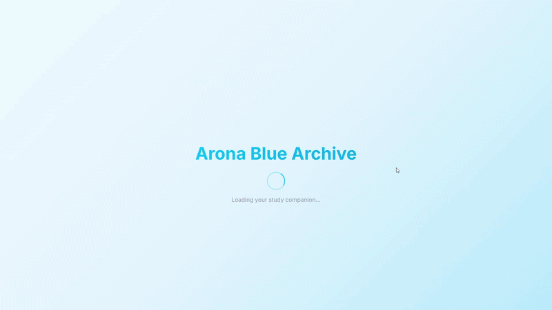

# ✨ Arona Study Companion

> Turn your study sessions into a calm, anime-powered focus experience.

<p align="center">
  
</p>

<p align="center">
  🎯 Anime-inspired Pomodoro app with music, achievements, and focus tracking.
</p>

---

## 🎬 Demo

<p align="center">
  
</p>

---

## 🚀 Live Demo

👉 https://arvinlabs.me/study-companion/

---

## ✨ Features

* ⏱️ Pomodoro Timer (25 / 45 / 60 min)
* 🎨 Anime Companions (Arona, Plana)
* 🎵 Lo-fi Music Player
* 🏆 Achievements & Streaks
* 📊 Focus Tracking
* 🌙 Light / Dark Theme
* 📱 Fully Responsive
* 📲 PWA Ready (installable & offline)

---

## ⚡ Quick Start

```bash
git clone https://github.com/ArvinFarrelP/study-companion.git
cd study-companion
open index.html
```

Or simply open `index.html` in your browser.

---

## ⭐ Support

If you like this project:

👉 Give it a **star ⭐ on GitHub**
👉 Share it with your friends

---

## 📄 License

MIT License © ArvinLabs

---

<p align="center">
  Made with ❤️ by ArvinLabs  
  <br>
  <i>quiet systems, verifiable focus</i>
</p>
